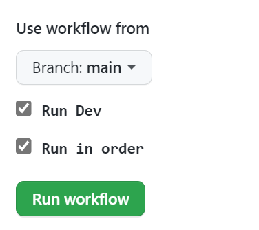
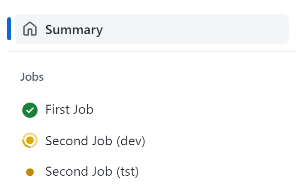
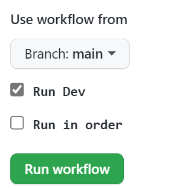
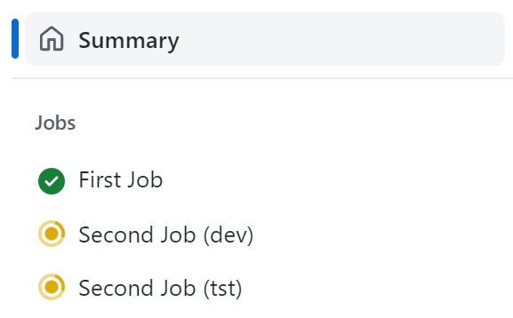
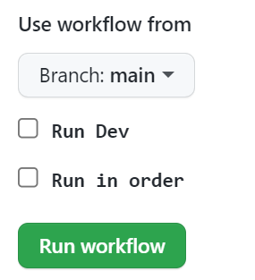

# Dynamically constructed matrix strategy

This repo shows a simple example of how you can dynamically construct a [matrix strategy](https://docs.github.com/en/actions/using-jobs/using-a-matrix-for-your-jobs) with GitHub Actions.

The example uses `workflow_dispatch` to allow the workflow to be executed manually with some inputs, just to easily demonstrate the mechanism:



When the default inputs are selected, the workflow will dynamically construct a strategy matrix in JSON during the execution of the `First Job`.  The JSON will be taken as an output from the first job and used as the value for the `strategy:` key of the `Second Job`.  It uses [fromJSON](https://docs.github.com/en/actions/learn-github-actions/expressions#fromjson) to take the JSON string and parse it into something GitHub Actions can understand.  

The result is the following being dynamically constructed:

````yaml

strategy:
  matrix:
    stage: ["dev", "tst"]
  fail-fast: true
  max-parallel: 1

````
This results in an ordered execution of the required stages, due to the [max-parallel](https://docs.github.com/en/actions/using-workflows/workflow-syntax-for-github-actions#jobsjob_idstrategymax-parallel) being defined as `1`.



Setting [fail-fast](https://docs.github.com/en/actions/using-workflows/workflow-syntax-for-github-actions#jobsjob_idstrategyfail-fast) to `true` (default) causes GitHib Actions to cancel all matrix in-progress or queued jobs.  Which would mean, in this example, that if `dev` fails then `tst` will not run.  



If `Run in order` is unchecked then the `Second Job` is not constrained to `max-parallel: 1` and normal parallel job execution takes place:



This also allows for the `stage` values to be dynamically constructed.  So, for example, we could uncheck `Run Dev`:



would construct the matrix as follows:

````yaml

strategy:
  matrix:
    stage: ["tst"]
  fail-fast: false
  max-parallel: 2

````

Obviously meaning that only the `tst` environment will be processed in this workflow execution.


> This is only a simple example but you can imagine you could construct quite a complex matrix strategy if so desired.
